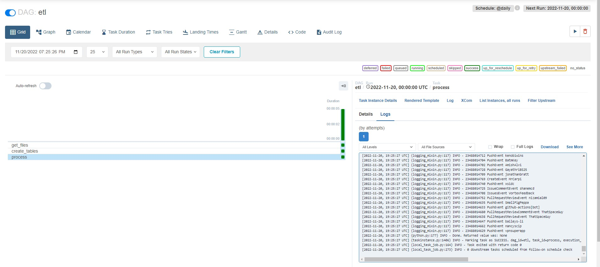
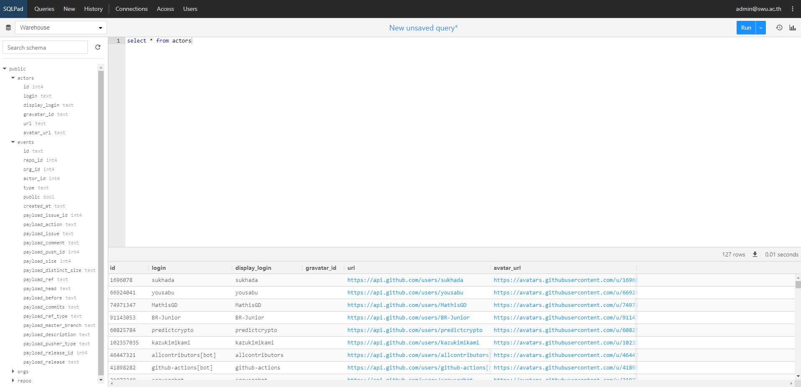

# Creating and Scheduling Data Pipelines

## Data modeling
The data model for this project is same as project 01, but this time we try to build it by using data pipetime, Airflow.


## Before we start running docker compose, we can write etl scripts (.py files) and save them into dags folder


## getting start

```sh
mkdir -p ./dags ./logs ./plugins
echo -e "AIRFLOW_UID=$(id -u)" > .env
```

## Running docker compose

```sh
docker-compose up
```

## Connect to Atrflow UI by following port 8080
Then we can activate etl dags and now we can see that a graph of operator process was created autonomously 
and all statuses of each process are turned to "success" (green color).





## now we can connect to SQLPad UI by following port 3000 to see our created tables



